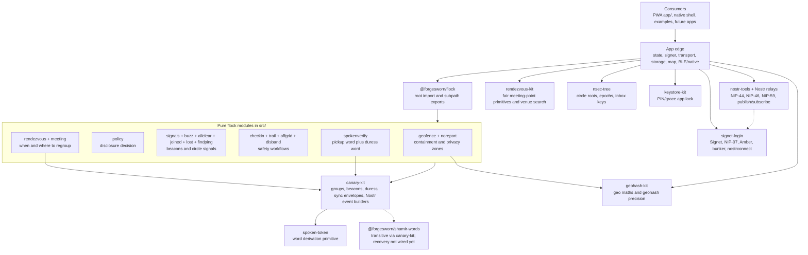

# flock library stack

This is the reusable library and ForgeSworn-tooling stack behind flock. It is
separate from the hosting/deploy view in `docs/ARCHITECTURE.md`.

## ForgeSworn technology in use

| Layer | Technology | Where it is used | Role in flock |
|---|---|---|---|
| Public package | `@forgesworn/flock` | `src/`, `package.json` exports | Pure TypeScript location-safety library: geofences, policy, signals, check-ins, trails, buzzes, all-clear, rendezvous, meetings, spoken verification, and related signal types. |
| Safety/crypto foundation | `canary-kit` | `src/index.ts`, `src/signals.ts`, `src/*` signal modules | Re-exported by flock; provides groups, beacons, duress, Nostr signal builders, NIP-59/NIP-44 helpers, and sync envelopes. |
| Root word primitive | `spoken-token` | via `canary-kit` | Underlying HMAC-counter-to-words primitive used by canary-style verification and duress words. |
| Recovery primitive present in graph | `@forgesworn/shamir-words` | transitive dependency of `canary-kit` | Installed as part of the canary stack, but flock has not wired it into a user-facing circle recovery flow yet. |
| Geo primitives | `geohash-kit` | `src/geofence.ts`, `app/src/app.ts`, `app/src/meetingPoint.ts` | Haversine distance, point-in-polygon, geohash encoding/decoding, bounds, and privacy precision controls. |
| Fair meeting points | `rendezvous-kit` | `app/src/meetingPoint.ts`, `app/src/venues.ts` | On-device isochrone/fairness primitives and venue search boundary for meeting-point suggestions. |
| Sign-in/key custody | `signet-login` | `app/src/app.ts`, `app/src/signer.ts`, `app/src/signin.ts` | Remote signer path for Signet, NIP-07, Amber, `bunker://`, and `nostrconnect://`; raw `nsec` paste is deliberately excluded. |
| Deterministic personas/epochs | `nsec-tree` | `app/src/keys.ts`, `app/src/wordcode.ts`; also a `canary-kit` dependency | Circle seed derivation, reseed epochs, rotating group inbox keys, and backup word-code derivation. |
| Local key-at-rest protection | `keystore-kit` | `app/src/lock.ts` | App lock: PIN-wrapped storage secret, grace unlock, burn/reset paths, encrypted persisted state. |
| Compatible remote signer target | `heartwood` | no package import; reachable through generic NIP-46/bunker support | A self-hosted Heartwood signer can connect through the Signet/NIP-46 path today. Per-circle Heartwood personas are still future work. |

## Library stack diagram

## What is not yet adopted

These are on the ForgeSworn map but are not current flock-owned workflows or
direct app integrations. Some may already be present transitively.

| Technology | Intended fit |
|---|---|
| `dominion` | Replace the hand-rolled circle membership/reseed layer with epoch-based access control, tiers, rotation, and revocation. |
| Direct `@forgesworn/shamir-words` plus `cairn-kit` adoption | Social and coercion-aware recovery for circle roots or identity material; `shamir-words` is present transitively today, but flock is not invoking it for recovery yet. |
| `stash` | Cross-device encrypted-to-self state restore without a central server. |
| `mesh-kit` plus `mesh-webrtc-lan` | Offline/LAN/no-relay transport behind the same opaque wrap format. |
| `anvil` | Hardened release automation. |
| `lodestone` | Workshop/dependency map once the library stack is ready to advertise. |
| `charter`, `kindred`, trust tools | Possible family governance, circle, and vouching layers; scope still to confirm. |
